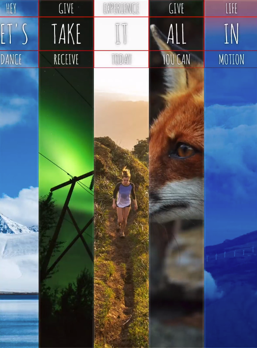
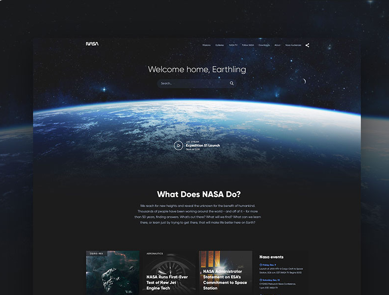

# MPaluszynski.github.io

## Layout 1

Layout oparty o flexboxa do przeglądania zdjęć

Pochodzi ze strony 30 days Javascript

## Layout 2

Layout oparty o stronę national geographic

Oryginał: [LINK](https://i0.wp.com/css-tricks.com/wp-content/uploads/2016/01/finished.png?resize=1000%2C656&ssl=1

## Layout 3

Layout oparty o stronę NASA

Oryginał: 
